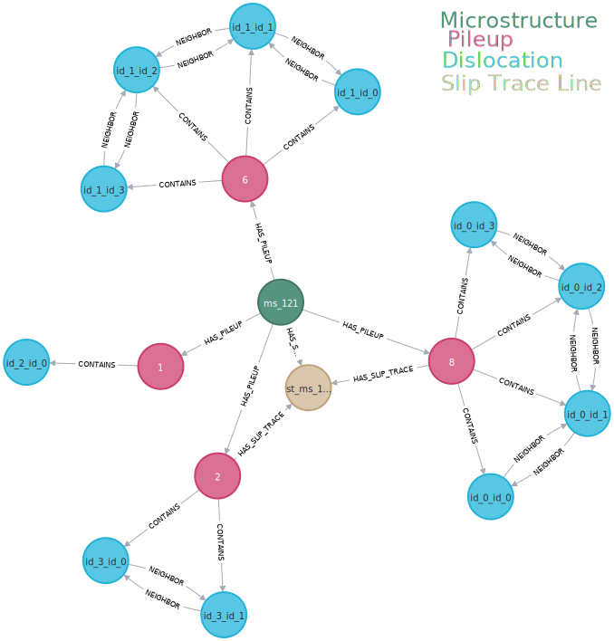

# GraphRAG: # Microstructure Knowledge Graph Ontology using Neo4j

This project uses a knowledge graph to represent and explore the hierarchical structure and spatial relationships within microstructural data – with a special focus on dislocation phenomena – as they appear in [synthetic datasets](https://iopscience.iop.org/article/10.1088/2632-2153/ad1a4e/pdf) especially designed for machine learning studies. The ontology focuses on modeling **dislocation pileups**, their associated dislocations, and their geometric characteristics, making it suitable for advanced reasoning tasks and graph-based querying.

### 🧩 Ontology Structure

The ontology consists of four primary node types and five relationship types, organized in a hierarchical and spatial layout as follows:

<p align="center">
  
</p>

---

#### 🔹 Nodes

- **Microstructure**
  - Represents the top-level dislocation microstructure under investigation.
  - It is the entry point of the graph and aggregates the entire microstructural configuration.

- **Pileup**
  - A localized group of dislocations accumulating at a barrier.
  - Characterized by:
    - `start location of first dislocation`
    - `slip width`
    - `slip direction`
    - `number of dislocations`

- **Dislocation**
  - Individual line defect within a pileup.
  - Characterized by:
    - `spline-id`
    - `position`
    - `spacing` (distance to the next dislocation in the pileup)

- **SlipTrace**
  - Represents the pair of lines that indicate the direction and presence of slip (plastic deformation). These are sometimes very clearly visible in TEM micrographs. 
  - Associated with one or more pileups.

---

#### 🔗 Relationships

- **Microstructure → HAS_PILEUP → Pileup**
  - A microstructure may have one or more pileups.

- **Pileup → CONTAINS → Dislocation**
  - A pileup contains one or more dislocations.

- **Dislocation → NEIGHBOR → Dislocation**
  - Indicates spatial adjacency or sequencing between dislocations in a pileup.

- **Pileup → HAS_SLIP_TRACE → SlipTrace**
  - One pileup may be associated with slip trace lines.

---

## 🧰 Prerequisites

 1. Python 3.9
 2. Docker & Docker Compose 
 3. [pyenv](https://github.com/pyenv/pyenv) & [pyenv-virtualenv](https://github.com/pyenv/pyenv-virtualenv)
 4. OpenAI API Ky

---

## ⚙️ Setup Instructions

### 1. Clone the Repository

```bash
git clone https://github.com/kgovind0001/GraphRAG-Dislocation.git
cd GraphRAG-Dislocation
```


### 2. Configure Environment Variables
Create a `.env` file in the root directory and add your OpenAI API key:

```env
OPENAI_API_KEY=your_openai_api_key_here
NEO4J_URI="neo4j://localhost:7687"
NEO4J_USERNAME = "neo4j"
NEO4J_PASSWORD = "password"
```


### 3. Set Up Python Environment
Use `pyenv` and `pyenv-virtualenv` to create and activate a Python 3.9.0 environment:

```bash
pyenv install 3.9.0
pyenv virtualenv 3.9.0 graphrag-env
pyenv activate graphrag-env
```


### 4. Install Dependencies
Install the required Python package:

```bash
pip install -r requirements.txt
```


### 5. Launch Neo4j with Docker
Ensure Docker and Docker Compose are installed, then start the Neo4j server:

```bash
docker-compose up -d
```
### 6. Create Database
This will set up a Neo4j instance with the necessary plugins for vectorized storage and OpenAI integration. Next step is to create database in Neo4j. A small sample data of 5 microstructures has been provided to test the application. 

```bash
python src/inject.py
```

### 7. Run the Application
Start the GraphRAG application:

```bash
streamlit run app.py
```

---

## 📁 Project Structure

```plaintext
GraphRAG-Dislocation/
  ├── sample_data               # Input data files
  src
    ├── agent_nodes
    │   ├── cypher_generator.py
    │   ├── cypher_validator.py
    │   ├── guardrails.py
    │   ├── __init__.py
    ├── config.py
    ├── executor.py
    ├── __init__.py
    ├── inject.py         # Create database and define nodes, relations 
    ├── llm_query.py
  ├── .env                # Environment variables
  ├── requirements.txt    # Python dependencies
  ├── app.py              # Streamlit application
  └── docker-compose.yml  # Docker Compose configuration
```

---

## 🧪 Testing the Setup

After running the application, you can test its functionality by:
1. Adding more sample data to the `sample_data/` directory.
2. Ensuring the data is ingested and processed correctly.
3. Submitting queries and verifying the responses are accurate and contextually relevent.

---

## 🤝 Contributing

Contributions are welcome! If you have suggestions for improvements or new features, feel free to open an issue or submit a pull request.
---

## 📄 License

This project is licensed under the MIT License. See the [LICENSE](https://github.com/kgovind0001/GraphRAG-Dislocation/blob/main/LICENSE) file for details.

---

## 🙌 Acknowledgents

Developed by [Kishan Govind](https://github.com/kgovind0001).

---

Feel free to customize this README further to match your project's specific details and requirements. 